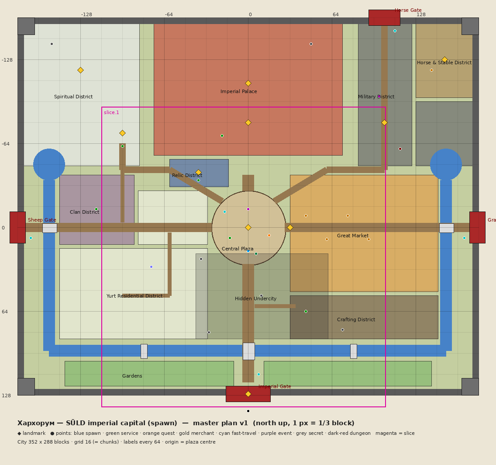

# Kharkhorum — Master City Plan (v1)

**Machine-readable source of truth:** [`assets/world/kharkhorum/master-plan.json`](../../assets/world/kharkhorum/master-plan.json),
[`points.json`](../../assets/world/kharkhorum/points.json) and the image-derived
[`reference-plan.json`](../../assets/world/kharkhorum/reference-plan.json).
**Map:** [`master-plan-map.png`](../../assets/world/kharkhorum/master-plan-map.png), produced by `python3 tools/world/render_plan_map.py`.
**Validation:** `python3 tools/validation/validate_world_plan.py` (also runs in `tools/validation/run_all.py`).
**Inputs:** [reference-analysis.md](kharkhorum/reference-analysis.md) (composition, primary) and
[KHARKHORUM_RESEARCH_BRIEF.md](KHARKHORUM_RESEARCH_BRIEF.md) (history and details).

## 1. Coordinate system and grid
- **City-local coordinates.** Origin (0, 0, 0) is the centre of the Central Plaza at base ground level.
  **+x = east, +z = south, +y = up.**
- **The 16-block grid equals chunks.** In the world, the origin sits on a chunk corner, so every grid cell is
  one chunk. The WorldBuilder places blocks chunk by chunk.
- The world anchor is chosen when the city is placed (terrain-aware site selection) and stored in
  `suld_world_builds`. World position = anchor + local position.
- City bounds: **x −176…175, z −160…127 (352 × 288 blocks = 22 × 18 chunks)**. Walking from the plaza to any
  gate takes about 30–45 s.

## 2. Macro structure
| Element | Coordinates | Notes |
|---|---|---|
| Ceremonial axis (N–S) | x = 0 | Imperial Gate → avenue → Grand Bridge → plaza → grand stair → palace |
| Cross-axis (E–W) | z = 0 | Sheep Gate ↔ plaza ↔ Grain Gate |
| Central Plaza | circle r 28 at (0, 0), +1 | spawn, monument, events |
| Imperial Avenue | x −4…4 (9 wide), z 28…118 and z −28…−40 | lantern posts every 8 |
| Grand stair | z −40…−56, rising 0 → +8 | 11 wide, landings every 4 steps |
| Palace terrace | x −72…71, z −156…−56, +8 | retaining wall, palace gate at the front |
| Inner canal (U) | west arm x −152, south run z 94, east arm x 151 (z −36…94) | 9 wide (7 water), surface y −1; ponds at both ends |
| Bridges | Grand (0, 94), West (−152, 0), East (151, 0), garden bridges (±80, 94) | Grand Bridge 9 wide, span 13 |
| Outer wall | rectangle; corner towers 13 × 13 × 26; wall towers every 48 | 5 thick, 12 high, walkway, crenellations |
| Gates | **Imperial** (0, 127) · **Sheep** (−176, 0) · **Grain** (175, 0) · **Horse** (104, −160) | historical gate markets: cattle and wagons / sheep and goats / grain / horses |
| Radial roads | NW diagonal → spiritual hill; NE diagonal → military, stables and Horse Gate | 5 wide |

## 3. Districts
| # | District | Bounds (x, z) | Elev. | Purpose and identity | Landmarks |
|---|---|---|---|---|---|
| 1 | Imperial Palace | −72…71, −156…−56 | +8 | courtyard, throne hall (8 × 8 columns, after Ögedei's 64-column hall), council, treasury, guards, gardens, hidden chamber | Great Palace, Silver Tree |
| 2 | Central Plaza | circle r 28 | +1 | spawn, orientation, events; concentric paving, banner poles, lantern ring | Khan's Equestrian Monument |
| 3 | Great Market | 32…144, −40…48 | 0 | the densest district: awnings, two-storey shops, inns, alleys, caravans | Market Gate |
| 4 | Crafting | 32…144, 52…84 | 0 | forges, smelters, jewellers, glass and stone (historical artisans near the centre) | — |
| 5 | Spiritual | −172…−84, −156…−48 | +4 | Tenger Sky Shrine, temple street of many faiths, sacred garden | Spirit Shrine, Eagle Monument |
| 6 | Military | 84…124, −156…−48 and 128…171, −96…−48 | +2 | barracks, training yard, armory, command ger; severe | Wolf Monument |
| 7 | Yurt Residential | −144…−32, 16…84 and −84…−32, −28…12 | +1 | organic yurt clusters, fenced yards, fire pits | — |
| 8 | Clan | −144…−88, −40…12 | +1 | walled clan compounds (the historical cordon of compounds) | — |
| 9 | Horse & Stables | 128…171, −156…−100 | +2 | horse market (historical north-gate market), stables | Horse Monument |
| 10 | Relic | −60…−16, −52…−32 | +2 | Relic Hall (world-unique relics) | Relic Hall |
| 11 | Gardens | −140…−12 and 12…139, 102…120 | 0 | blossom groves, ponds, pavilions | — |
| 12 | Outer Wall | perimeter | 0 | defence, skyline, gates | Imperial Gate |
| 13 | Hidden Undercity | −40…60, 20…84 at y −12 | −12 | old kilns and cellars; secret entrances | — |

Elevation rule: the city **rises from south to north**. Canal and gardens are lowest (−1…0), the plaza is +1,
the residential and clan districts +1, the spiritual hill +4, and the palace terrace +8, the top of the skyline.

## 4. Scale system (Minecraft proportions)
| Element | Size (blocks) |
|---|---|
| Player | 1.8 tall |
| Door | 1 × 2 (common) · 3 × 4 (imperial) · palace gate passage 5 × 7 · city gate passage 7 × 9 |
| Streets | avenue 9 · cross-axis 7 · secondary 5 · lane 3 |
| Houses | small 7 × 7 · medium 9 × 11 · large 13 × 15 (two storeys ≈ 9 tall with roof) |
| Yurts | diameter 7 / 9 / 13 |
| Market stall | 5 × 4 footprint, 4 tall |
| Palace | throne hall 33 × 41 × 14 inside · rooms 11 × 11 × 7 · total height ≈ 34 |
| Walls | 5 thick, 12 high (+crenellation) |
| Towers | wall 9 × 9 × 20 · corner 13 × 13 × 26 · watchtower 9 × 9 × 22 |
| Plaza | Ø 57 |
| Bridges | main 9 wide (span 13) · side 5–7 wide |
| Stairs | vanilla 1 : 1; grand stairs 11 wide with landings every 4 steps |

## 5. Gameplay points and player flow
All points are in [`points.json`](../../assets/world/kharkhorum/points.json), validated to lie inside their
district. First-time flow: **spawn (0, 18) → class stones (−14, 8) → plaza tutorial (6, 20) → first quest
(16, 6) → general merchant (44, −9) → blacksmith (44, 64) → Imperial Gate relay (8, 112) → first adventure
outside the gate.** Every first-session service is within about 130 blocks of spawn.

Secrets are registered (not ad hoc): the abandoned cellar → undercity, the undercity NPC, the hidden shrine,
the secret palace room, hidden treasure, and the shortcut tunnel.

## 6. Build order and review workflow
Each slice goes **BUILD → VALIDATE → RENDER → REVIEW → FIX → APPROVE → LOCK**. Approved and locked areas are
never overwritten silently. The WorldBuilder refuses to write into a locked area.

Slices:
1. **Slice 1 — ceremonial axis** (bounds x −112…104, z −92…136): Imperial Gate with wall stubs, one
   watchtower, the avenue with the Grand Bridge and a canal stub, the Central Plaza with its monument, the
   grand stair and palace entrance, one market street, one yurt block, one blacksmith, one shrine.
2. After approval, expand district by district: palace → market → residential → spiritual → military →
   remaining walls → gardens → undercity.

## 7. Authoring tools
Hand-authored detail may be built with **Axiom / WorldEdit as development tools only** and exported as Sponge
`.schem` files. SÜLD places them itself, so the production server never needs those tools. See
[ARCHITECTURE.md](ARCHITECTURE.md).
